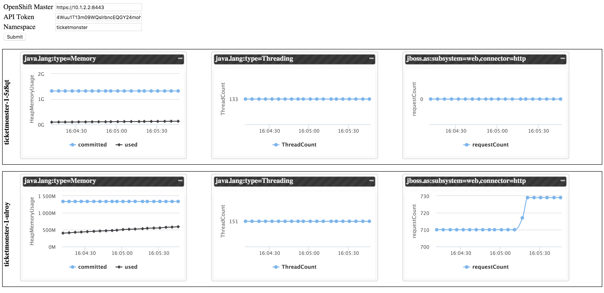

OpenShift Jolokia Demo
=====================

Demonstrates retrieving JMX statistics from running applications using the [Jolokia](https://jolokia.org/) HTTP bridge in OpenShift.

## Overview

Java applications and application servers provide the ability to manage and monitor applications through the JMX technology. Application servers, as part of [JBoss xPaaS](https://www.openshift.com/enterprise/middleware-services.html) are packaged with a Jolokia agent that exposes JMX operations over HTTP. This repository provides a demonstration on how to consume JMX operations using the Jolokia bridge in OpenShift

## Accessing Jolokia Statistics

Packaged in xPaaS images is a Jolokia agent and when the image is started in a pod within OpenShift, JMX metrics are exposed by the container on port 8778. However, access to this port cannot be achieved through creating Services and exposing a Route as is typically achieved. Instead, the OpenShift api server contains a proxy that can be used to access the internal pod network. Once access to the internal network is achievable, it is possible to access a port exposed by a running container. Since Jolokia is exposed, the resources can be accessed.

## Demo 

### Overview

This demo uses restful services to communicate with the OpenShift API to locate pods in a project (namespace) that have the Jolokia port exposed, and to view key several key metrics (heap, thread count, and number of requests sent from the JBoss web subsystem).

### Configuring the OpenShift Environment

The demo uses the Jolokia javascript client to communicate from the web browser to OpenShift. Since responses from OpenShift will not be originating from the same location as the demo page, this violates same-origin policy. To allow OpenShift to allow access to resources outside its own domain, a modification must be made in the master configuration file located at */etc/origin/master/master-config.yaml*. 

Add a **- .*** value under *corsAllowedOrigins*

```
corsAllowedOrigins:
- 10.0.2.15:8443
- 127.0.0.1
- localhost
- .*
```

Restart the OpenShift master:

    systemctl restart atomic-openshift-master
    

### Retrieving an API token

An OAuth token is used to communicate from the demo to the OpenShift environment. The easiest way to retrieve an API token is to login using the OpenShift CLI and run the following command:

    oc whoami -t
    
### Running the Demo

Use the following steps to run the demonstration from your local machine.

First, clone this repository

    https://github.com/sabre1041/ose-jolokia-demo.git
    
Run the `index.html` file which should open your the browser

Enter the following into the input boxes:

* Enter the OpenShift API URL (*https://master.ose.example.com*)
* Enter the API token retrieved in the section above
* Enter the namespace (project) to view pods exposing the Jolokia port

Click submit to view metrics and enjoy the demo. 


